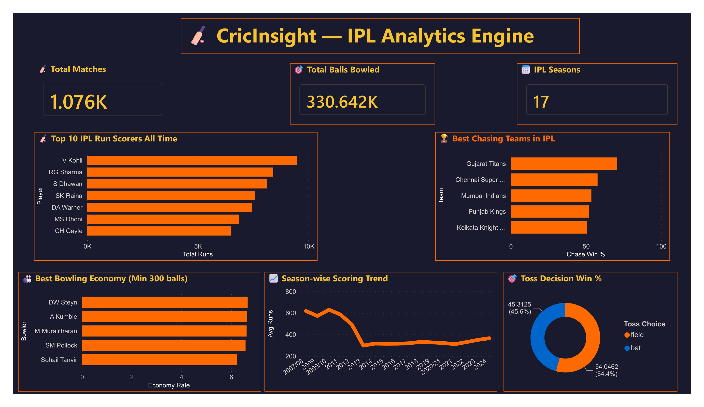

 #🏏 CricInsight — IPL Analytics Engine

> Turning 330,000+ balls of IPL data into real cricket intelligence using MySQL.

---

## 📌 Why I Built This

I've played cricket all my life and grown up watching IPL every season.
When I started learning SQL, everyone around me was building the same
boring projects — sales dashboards, library systems, hospital databases.

I asked myself — why not build something I actually care about?

Cricket has 1.5 billion fans worldwide. Every match generates thousands
of data points — every ball, every run, every wicket. Yet most people
only look at the scoreboard. I wanted to go deeper.

So I built CricInsight — an IPL analytics engine that answers questions
even broadcasters and team analysts think about:

- Does winning the toss actually help?
- Which batsmen are dangerous in death overs specifically?
- Can a SQL formula predict Player of the Match?

This project is my answer to all of that. Built with pure MySQL,
no shortcuts, no drag-and-drop tools — just SQL and curiosity.

---


## 📈 Dashboard Preview



---

## 📊 Dataset

- **Source:** [IPL Complete Dataset 2008-2020 — Kaggle](https://www.kaggle.com/datasets/patrickb1912/ipl-complete-dataset-20082020)
- **Tables:** `matches` (1,076 rows) and `deliveries` (330,642 rows)
- **Coverage:** 13 IPL seasons, 19+ teams, 500+ players

---

## 🔍 Key Insights That Surprised Me

These are real findings from my queries — not textbook answers:

| Insight | Finding |
|---|---|
| 🎯 Toss advantage | Teams choosing to **field first win 54%** of matches vs 45% batting first — chasing is king in T20 |
| 🏃 Best chasing team | **Gujarat Titans** win **70%** of chases — most clinical chasing side in IPL history |
| 🏟️ Home fortress | **KKR at Eden Gardens** — 45 wins, the most dominant home record in IPL |
| ⚡ Death over destroyer | **PD Salt** has the highest death over strike rate of **218** — most dangerous in final overs |
| 🧠 POTM model | My SQL prediction model correctly identified Player of the Match in **35.6%** of games — far better than random guessing |
| 👑 All time king | **Virat Kohli** leads all time run scorers with **9,481 runs** — data confirms what every fan already knows |

---

## 🏆 Highlight Feature — POTM Predictor

This is the most unique part of CricInsight.

After every IPL match, someone decides who gets the Player of the Match
award. But is that decision always data-driven? I built a scoring model
in pure SQL to find out.

**My formula:**
Performance Score = (Runs × 1) + (Wickets × 25)

**How it works:**
- Calculate every player's score for each match
- Rank players within each match using `RANK() OVER (PARTITION BY match_id)`
- Compare my predicted winner vs actual `player_of_match`
- Measure accuracy across all 1,107 matches

**Result: 35.6% accuracy (394/1,107 matches)**

For context — random guessing would give 5-10% accuracy.
My simple formula with no machine learning beat that by 3-4x.

The mismatches are equally interesting — they reveal cases where
fielding, captaincy, or bowling economy influenced the award
beyond just runs and wickets. That's a future improvement.

## 📁 Project Structure
```
cricinsight-ipl-sql/
├── module0_data_exploration.sql    # Understanding the dataset
├── module1_batting.sql             # Batting analytics
├── module2_bowling_advanced_batting.sql  # Bowling + phase analysis
├── module3_team_strategy.sql       # Toss, chasing, venue analysis
├── module4_potm.sql                # POTM prediction model
└── module5_season_trends_and_views.sql   # Trends + DB views
```
---

## 💡 SQL Concepts Used

| Concept | Where Used |
|---|---|
| `SUM`, `COUNT`, `AVG` | Batting and bowling aggregates |
| `SUM(CASE WHEN)` | Conditional counting — fours, sixes, wins |
| `INNER JOIN` | Connecting deliveries with matches |
| `HAVING` | Filtering players with enough data |
| `RANK() OVER (PARTITION BY)` | Season rankings, POTM predictor |
| `LAG() OVER (ORDER BY)` | Year-over-year trend comparison |
| Chained CTEs | Multi-layer POTM prediction logic |
| `CREATE VIEW` | Virtual tables for Power BI dashboard |
| Backtick escaping | Handling reserved keyword `over` |

---

## 🛠️ Tech Stack

- **Database:** MySQL 8.0
- **IDE:** MySQL Workbench
- **Visualization:** Power BI
- **Version Control:** GitHub

---

## 👤 Author

**Sujal Sakla**
B.Tech CSE (Data Science) — Ramdeobaba University, Nagpur
[LinkedIn](https://www.linkedin.com/in/sujalsakla) | [GitHub](https://github.com/SujalSakla)
